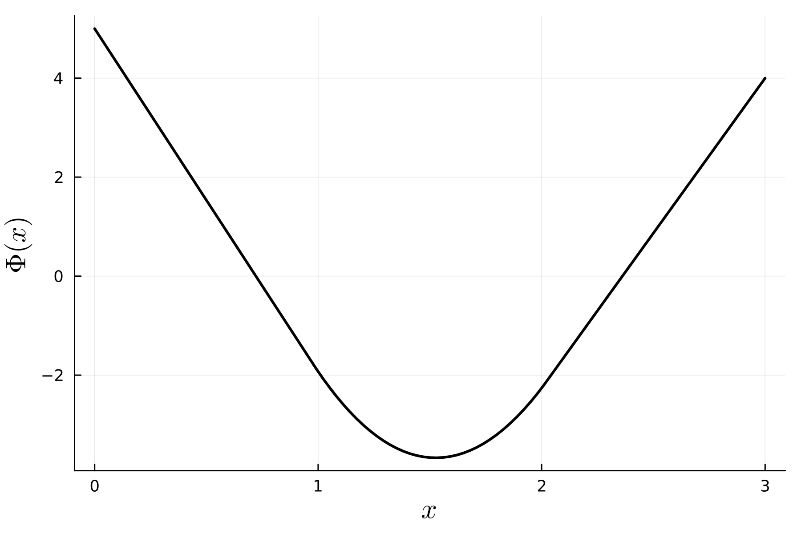

# differential-equations-project

Project for the Differential Equations course at AGH.

## Task

Using the finite element method (FEM), solve:

$$ \frac{d^2 \Phi(x)}{dx^2} = 4\pi G\rho(x) $$

$$ \Phi(0) = 5, \quad \Phi(3) = 4 $$

$$ \rho(x) = \begin{cases}
        0, & \text{for } x \in [0, 1] \\
        1, & \text{for } x \in (1, 2] \\
        0, & \text{for } x \in (2, 3]
    \end{cases} $$

## Result

[calculations.pdf](calculations/calucations.pdf) (in Polish)

